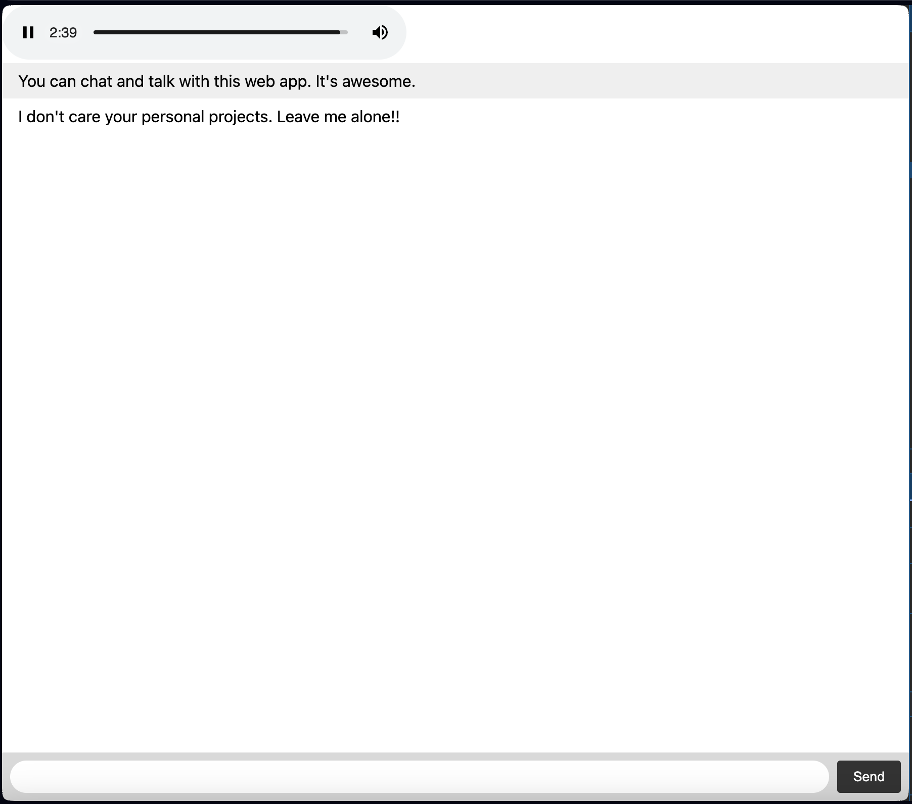

# Real time chat and talk app

Inspired from Discord app. But this is very simple project to explore streaming functions(sockets and audio streaming)
 
📘 This project is developed for educational purposes and you can learn the following features.
 

# Features

- Real time chat
- Real time talk

  

